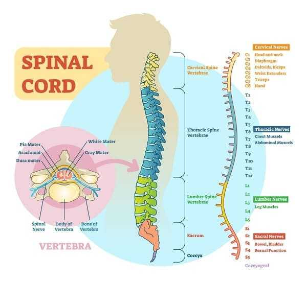

## Muscles in the Lower Back

The lower back (lumbar region) consists of five spinal vertebrae, which are cushioned by intervertebral discs. The ligaments maintain the vertebrae in place, while tendons attach muscles to bones.

There are two major muscles that work together to stabilize and support the spine and hips. They are the quadratus lumborum muscle (informally called the QL) in the lower back and the gluteus medius in the buttocks. When these muscles are strained, they feel stiff, tired, and painful.

Though disease, like spinal disc degeneration, can cause low pain, the most common reasons for muscle strain include sitting with poor posture for hours at a time, lifting heavy items improperly, and not maintaining strong back muscles through regular exercise. Stress can also cause tense or tight muscles, which are more prone to injury.

Low back pain can interfere with even simple activities, like bending forward to tie shoes or working at a computer.

## **Does Massage Help Back Pain?**

There is a lot of published research that demonstrates massage can help back pain. The American Massage Therapy Association points to the research to support the belief that therapeutic massage is effective for persistent low back pain and able to provide long-lasting benefits. The benefits of back massage include the following:

Reduces or eliminates pain
Relaxes tight muscles
Improves blood circulation
Assists with easing feelings of stress and anxiety
Speeds up the return to normal activities
Supplements conventional treatments, like taking anti-inflammatory pain relievers and applying ice or heating pads.

<!--StartFragment-->

A physical therapist or a massage therapist can provide therapeutic massages. A physical therapist will include massage as one element of a treatment plan that may include activities like light exercises and stretching. If the low back pain is due to muscle strain, many people find a massage therapist on their own. The massage for muscle strain is often all it takes to experience pain relief.

<!--EndFragment-->

<!--StartFragment-->

## Types and Styles of Massage

There are two basic types of massage: whole body and structural. The whole body massage promotes general relaxation. The spine massage techniques that target specific muscles and connective tissue are called structural massages. A structural massage that targets the muscles from the buttocks and up to the neck is effective for relieving lower back pain.

Some massage styles include the whole body with a special focus on a targeted area. However, all massage styles have the likelihood of helping to relieve pain. The best style to have the most impact depends on what is causing the pain and preferences of the patient or client. The various styles of massage include, but are not limited to:

* Swedish massage – a whole body gentle massage for relaxation and to relieve muscle knots.
* Shiatsu massage – a Japanese style whole body massage using pulsing pressure and includes a focus on areas of the body needing attention.
* Trigger point massage – the whole body that includes an extra focus on specific areas of pain caused by tightness (trigger points) in muscle tissues.
* Deep tissue massage – a whole-body massage that uses pressure to relieve tension in deeper layers of connective tissues and muscles.

There are other styles of massage, like Reflexology and Sports Massage, but the ones listed are some of the more common. For people who experience back pain, massage therapy can bring much-needed relief. There is no set amount of sessions recommended because each situation is different.

## Work with Your Doctor

There is a general agreement that spine massage therapy can relieve muscle tension and help restore balance in the working of the muscles in the lower back. Spine massage therapy is normally used in combination with other treatments that include over-the-counter medications, exercise, posture improvement (especially when sitting), and physical therapy. It is important to talk to your doctor about your low back pain and develop a plan of action for living a pain-free life.

<!--EndFragment-->

<!--StartFragment-->

To speak with a specialist, call us at **+(351) 963 531 684**. We’re happy to answer your [MASSAGE QUESTIONS](https://www.algarvehomemassageandbeauty.com/prices-massage). Of course, questions are welcome during your session too;

### Book your appointment today!

<!--EndFragment-->